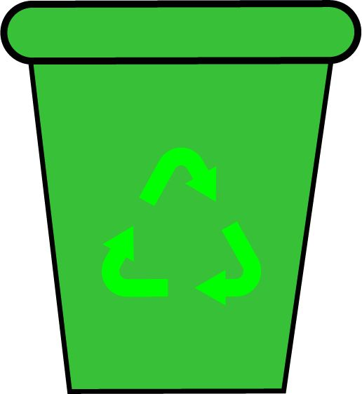

 

# O Esquilo da Reciclagem
## Um jogo divertido sobre reciclagem!
### Ana Calamote | Sara Sequeira | Sofia Martinho

Este projecto consiste numa ideia de um videojogo do tipo one-click, com o tema da reciclagem de lixo.
Em termos de mecânicas do jogo, basicamente um esquilo está pendurado num galho de uma árvore, a ir para cima e para baixo com lixo nas mãos, enquanto aparece aleatóriamente os caixotes da reciclagem para colocar o lixo. O objetivo é colocar o lixo correcto no caixote correcto!
Se colocar no caixote correcto, ganha ponto; se tiver 0 pontos e errar, não ganha ponto; se tiver pontos e errar, perde ponto.

### Ecrã de Início
Este ecrã é o ecrã de início. Tem um botão para podermos iniciar o jogo e uma imagem de fundo relacionada com o tema do jogo.

### Ecrã do Jogo
Este ecrã é o ecrã do jogo, com todos os assets (que irão ser falados a seguir).

### Personagem Principal
A personagem deste jogo é um esquilo que está preso a uma árvore pelo galho com a cauda dele a segurar.

### Caixotes do Lixo em movimento
Os caixotes do lixo que estão em movimento durante o jogo são os principais da reciclagem, sendo eles o "indiferenciado", "vidro", "cartão e papel" e "plásticos".

### Lixo
Ao longo do jogo, o esquilo vai segurando diferentes tipos de lixo diferentes com as patas com o intuito de os deitar no caixote correto.

### "Acertaste!"/"Erraste!"
Quando o jogador acerta ou erra a colocar o lixo nos contentores correctos, aparece diferentes pop ups correspondentes a cada situação.